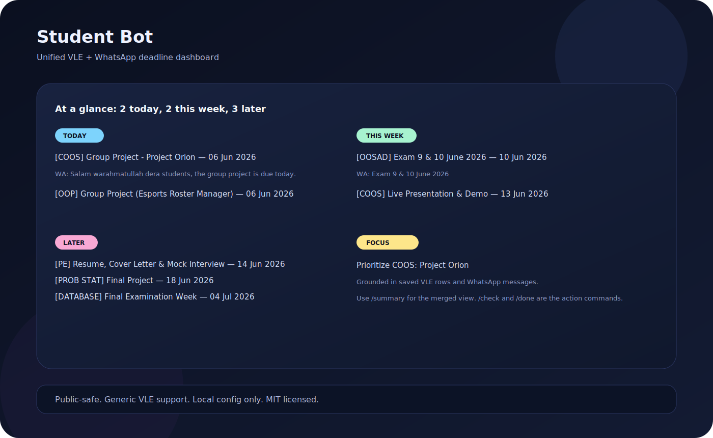

# whatsapp-assignment-dashboard

[](LICENSE)


Academic tracker for universities that run a Moodle-style VLE and WhatsApp groups.
It pulls deadlines from course pages and PDFs, watches course WhatsApp groups through WAHA, and turns the noise into one compact Telegram dashboard.

Formerly `student-bot`.

## What It Does

Academic info usually lives across:

- **VLE / Moodle** for formal assignments and announcements
- **WhatsApp groups** for last-minute reminders, cancellations, and schedule changes
- **Course plans / PDFs** for semester schedules that drift from reality

## Why It Exists

Manually checking multiple course pages and group chats every day is noisy and easy to miss.

This bot keeps the task list in one place:

```text
VLE Moodle ----------.
                     +--> Telegram Bot <-- /summary, /agenda, /check
WhatsApp Groups -----'
```

## Highlights

- Deep VLE scraping with Playwright
- PDF/resource-name scanning before downloads
- Course-plan PDF parsing
- WhatsApp monitoring through WAHA
- Unified Telegram interface for alerts, summaries, and task management
- Urgency grouping for today, this week, and later
- Deduping and cancellation handling for WhatsApp-driven updates
- SQLite-backed storage for deadlines and message state

## Demo Preview



Illustrative preview only. The live bot renders a `/summary` dashboard that merges VLE and WhatsApp into one view.

## Tech Stack

| Layer | Tech |
|-------|------|
| VLE scraping | Python, Playwright, requests |
| PDF reading | pdftotext (poppler), pdfminer.six, python-docx |
| WhatsApp bridge | [WAHA](https://github.com/devlikeapro/waha) |
| Webhook receiver | Flask |
| Telegram bot | Python requests |
| Storage | SQLite |
| Hosting | DigitalOcean Droplet (Ubuntu) |
| Process manager | PM2 |

## Telegram Commands

```text
/summary        main merged dashboard
/agenda         alias for /summary
/tasks          pending deadline tasks
/check 5        mark task 5 done
/list           pending WhatsApp messages
/done 3         mark WhatsApp message handled
/scrape         re-scan VLE now
/today          today's WhatsApp messages
/digest         send morning summary now
/stats          show counts
/help           full command list
```

## Architecture

```text
VLE scraper ----> deadlines.db --.
                                 +--> bot.py <--> Telegram
Webhook receiver -> messages.db -'

WAHA Docker <--> WhatsApp <--> webhook receiver
```

## Setup

1. Clone the repo.
2. Copy `config.example.py` to `config.py` and fill in Telegram, VLE, and WAHA settings.
3. Install dependencies with `pip install -r requirements.txt`.
4. Install Playwright browsers with `playwright install chromium`.
5. Run `get_session.py` to capture the VLE browser session into `storageState.json`.
6. Start the WAHA Docker container for the WhatsApp bridge.
7. Use PM2 to run `bot.py`, `webhook_receiver.py`, and the scraper worker.

## Public-Safe Defaults

- `config.py` stays local and is ignored by git.
- `config.example.py` shows the required fields without real secrets.
- Set `VLE_BASE_URL` to your university portal.
- Set `VLE_COURSES` to the course-code map you want scraped, or leave it empty to auto-discover visible course links.
- Set `WHATSAPP_MONITORED_GROUP_ALIASES` to the group-name hints you care about.
- Set `WAHA_API_KEY` and `WAHA_PAIR_NUMBER` locally for your WhatsApp bridge.

## Security Notes

- Keep `config.py` local and never commit it.
- Never commit `storageState.json`, `*.db`, API keys, or VLE credentials.
- Helper scripts should import secrets from `config.py` instead of hardcoding them.

## License

MIT. See [LICENSE](LICENSE).

## Contributing

See [CONTRIBUTING.md](CONTRIBUTING.md) and the GitHub issue templates under `.github/`.

## Roadmap

See [ROADMAP.md](ROADMAP.md) for the current public plan.
